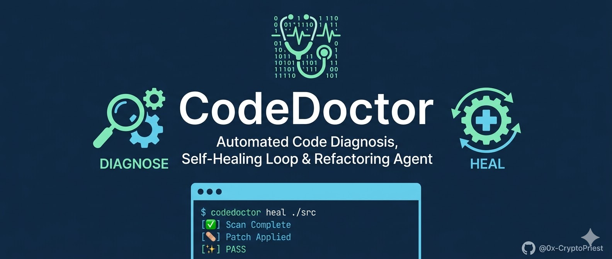
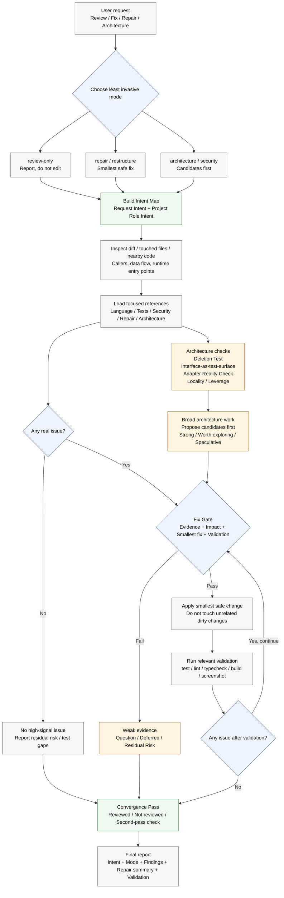

<p align="center">
  
</p>

# Code Doctor

Code Doctor is an evidence-backed review, repair, and controlled restructure skill for serious codebases.

It is designed for agents that should not merely comment on code. When the user asks for a review, fix, bug repair, acceptance check, security pass, or architecture cleanup, Code Doctor builds the project intent, chooses the least invasive capable mode, finds real issues, applies the smallest safe fix when authorized by the request, validates the result, and reports exactly what changed.

The daily user experience should be natural language, not command choreography. Users can say things like "review this change", "fix the problems in this PR", "cross-check these architecture findings", or "use code-doctor before merge". The skill decides which capability to use and only asks for clarification when the next action is risky, destructive, or impossible to infer safely.

## What It Does

Code Doctor helps an agent perform six related jobs.

### Intent-First Review

Before judging code, the skill asks what the project is trying to do and what role the touched code plays inside that project.

It builds two layers of intent.

Request intent comes from:

- README, product docs, ADRs, task notes, or issue descriptions
- public APIs and route contracts
- tests and fixtures
- config, CI, lint, typecheck, quality gates, and security settings

Project role intent comes from:

- touched modules, components, commands, routes, workers, adapters, and tests
- callers, callees, ordering rules, and invariants
- data flow, persistence, trust boundaries, and external integrations
- the user workflow, admin operation, public contract, or background job the code supports

This prevents two common review failures: approving code because it answers only the user's wording while breaking its real project role, or approving code because it passes tests even though it solves the wrong problem.

### Evidence-Backed Findings

Findings must be tied to concrete evidence. A valid finding needs:

- a file and line when possible
- a trigger such as input, state, call order, config, or user action
- a real impact
- a smallest reasonable fix
- a validation path

Weak suspicions are reported as questions, residual risks, or second-pass items instead of being dressed up as hard blockers.

### Repair Loop

When the user asks the agent to fix problems, Code Doctor uses a repair loop:

1. Identify the highest-signal issue.
2. Check the Fix Gate: evidence, impact, smallest fix, validation.
3. Patch the smallest real defect.
4. Re-run the narrowest relevant check.
5. Review the new state again.
6. Continue only while high-signal in-scope issues remain.

The skill is intentionally biased toward small, verifiable repairs over broad rewrites.

### Controlled Restructure

When code structure is the actual problem, Code Doctor can restructure within a bounded scope.

Typical restructure moves:

- extract duplicated validation, formatting, or branching
- shorten oversized functions
- merge repeated caller logic into one helper or module interface
- replace unsafe ad hoc implementations with safer local patterns
- delete redundant code only after checking reachability, tests, migrations, and public contracts

The skill does not restructure merely because code looks imperfect. Structure work needs a proven maintenance, correctness, or testability risk.

### Architecture Deepening

For architecture work, Code Doctor looks for shallow modules and scattered behavior.

Signals include:

- callers repeat validation, authorization, mapping, retry, or formatting logic
- tests must reach into internals instead of using public behavior
- a module mostly passes data through while callers carry the real complexity
- a new adapter or interface has only one implementation and no real variation point

When implementation is appropriate, the skill deepens modules by reducing caller knowledge and moving behavior behind smaller public interfaces. When the task is only a review, architecture work is normally reported as a proposal unless the user explicitly asked for implementation.

Architecture mode uses five required deepening tools:

- consistent vocabulary: Module, Interface, Implementation, Depth, Seam, Adapter, Leverage, and Locality
- deletion test: if deleting a module makes complexity vanish, the module was shallow; if complexity reappears across callers, it was earning its keep
- interface-as-test-surface rule: callers and tests should prove behavior through the same public interface
- adapter reality check: one adapter is usually a hypothetical seam; two justified adapters make the seam real
- candidate proposal gate: broad architecture work is presented as candidates with recommendation strength before implementation, unless the current structure blocks the requested repair

### Convergence Pass

At the end of non-trivial work, Code Doctor records:

- what was reviewed
- what was not reviewed
- what commands or runtime evidence were used
- what a second pass should inspect first
- which remaining risks are blockers, deferred items, or out of scope

This reduces "second reviewer surprise" and keeps the final report honest.

## Operating Modes

The user does not need to choose these modes manually. They exist so the agent can behave predictably.

| Mode | Used When | Edits? |
| --- | --- | --- |
| `review-only` | User asks to review, audit, or check | No |
| `repair` | User asks to fix, address, repair, or make checks pass | Yes, smallest safe fixes |
| `restructure` | User asks to remove duplication, simplify, or fix poor structure | Yes, bounded refactors |
| `architecture` | User asks for architecture improvement or module deepening | Proposal by default; edits when authorized |
| `security` | Task concerns secrets, auth, permissions, injection, crypto, compliance, or exposure | Depends on request |

The default rule is: choose the least invasive mode that satisfies the request.

## Processing Flowchart

GitHub renders this Mermaid diagram directly in Markdown.



## Severity Model

Code Doctor uses a P0-P3 severity model.

| Severity | Meaning |
| --- | --- |
| `P0` | Data loss, security breach, auth bypass, production outage, irreversible migration failure |
| `P1` | Clear functional regression, public contract break, core workflow failure, quality gate failure |
| `P2` | Proven edge-case bug, maintainability or testability risk with a credible near-term trigger |
| `P3` | Low-risk cleanup, naming, style, or documentation issue |

`Intent Miss` is separate from severity. It is a hard blocker when the implementation solves the wrong problem.

## Fix Gate

Before editing code, Code Doctor requires four concrete answers.

| Gate | Question |
| --- | --- |
| Evidence | What file, line, diff, test, runtime path, or config proves the issue? |
| Impact | What user-visible, runtime, security, data, maintainability, or acceptance risk follows? |
| Smallest fix | What is the narrowest repo-aligned change that removes the risk? |
| Validation | What test, build, typecheck, lint, command, screenshot, or manual check can confirm it? |

If an issue does not pass this gate, the skill should not patch it.

## Scope Safety

Code Doctor is intentionally conservative around user work and project boundaries.

It should not:

- touch unrelated dirty worktree changes
- widen a fix just to make code look cleaner
- convert subjective style preferences into findings
- remove behavior, public API, compatibility, migration paths, logs, or tests without intent
- rewrite architecture during a narrow bug fix unless the structure blocks the correct repair
- claim the whole project is clean unless the whole project was actually reviewed

It may delete redundant code when it has checked dependency, migration, fixture, and public-contract risk.

## Output Shape

Code Doctor reports findings before summary.

A final response should include:

- `Intent`
  - `Goal`
  - `Non-goals`
  - `Constraints`
  - `Success criteria`
- `Mode`
- `Coverage` for non-trivial work
  - `Reviewed`
  - `Not reviewed`
  - `Second-pass check`
- findings ordered by severity
- repair or restructure summary when edits were made
- validation commands and results
- remaining risks or test gaps

Each finding should include:

- severity
- file and line when possible
- evidence
- impact
- fix

If nothing is wrong, the skill should say so clearly and still mention residual risk or test gaps.

The `Intent` block should combine the immediate request with the inferred project role of the touched code. It should answer both "what did the user ask for?" and "what responsibility does this code have in the system?"

## How To Use It

Most users should use plain language. The skill should infer the correct mode.

Examples:

- "Use code-doctor to review this diff before merge."
- "Use code-doctor to fix the issues in this branch."
- "Cross-check these architecture findings with code-doctor and repair the real ones."
- "Use code-doctor on the failing tests and address the root cause."
- "Run code-doctor on this security-sensitive endpoint."
- "Review this refactor with code-doctor and tell me if it preserved behavior."

The user should not need to provide a checklist of commands. The agent should discover repo-local tooling, run the relevant checks, and report what happened.

## What The Agent Loads

`SKILL.md` stays concise and points to references. The agent loads only the references relevant to the task.

| Reference | Purpose |
| --- | --- |
| `references/00-overview.md` | review contract, severity, evidence quality |
| `references/10-static-analysis.md` | static analysis and style |
| `references/20-testing-quality-gates.md` | test and quality-gate expectations |
| `references/30-peer-review.md` | PR review heuristics |
| `references/40-security-compliance.md` | security and compliance review |
| `references/50-acceptance-and-ui.md` | acceptance and UI checks |
| `references/60-repair-loop.md` | repair loop and stop conditions |
| `references/65-convergence.md` | coverage ledger and convergence pass |
| `references/70-intent-evaluation.md` | intent evaluation |
| `references/80-restructure.md` | bounded restructure pass |
| `references/85-architecture-deepening.md` | module depth and caller-knowledge reduction |
| `references/11-python.md` | Python review and repair playbook |
| `references/12-typescript-react.md` | TypeScript and React playbook |
| `references/13-go.md` | Go playbook |
| `references/14-swift.md` | Swift playbook |
| `references/41-api-backend.md` | backend API playbook |
| `references/42-security-audit.md` | security audit playbook |
| `references/95-benchmarking.md` | benchmark protocol |
| `references/90-sources.md` | source map |

## Evaluation Assets

The repository includes assets for validating the skill itself.

| Asset | Purpose |
| --- | --- |
| `scripts/validate_skill.py` | checks local references, external-link locality, and naming |
| `scripts/score_benchmark.py` | scores benchmark outputs |
| `benchmarks/fixtures` | local benchmark fixtures when present |
| `examples/review-output.md` | example review output |
| `examples/repair-loop-output.md` | example repair output |

Maintainers can run validation from the repository root:

```bash
python3 scripts/validate_skill.py
```

## Install

All supported agents:

```bash
npx skills add https://github.com/0x-CryptoPriest/code-doctor
```

Codex:

```bash
npx skills add https://github.com/0x-CryptoPriest/code-doctor --agent codex
```

Claude:

```bash
npx skills add https://github.com/0x-CryptoPriest/code-doctor --agent claude-code
```

Private repository access requires GitHub authentication on the machine.

## Local Installer

After cloning the repository:

```bash
./install.sh --all --force
```

Use `--codex` or `--claude` to install only one target.

## Design Philosophy

Code Doctor should be excellent at proving a problem exists, fixing the smallest real defect, and stopping before it becomes a rewrite.

Its best behavior is not "maximum change". Its best behavior is:

- understand intent
- find the real issue
- avoid cosmetic noise
- patch only when evidence is strong
- validate with local tooling
- report scope honestly
- leave unrelated code alone
